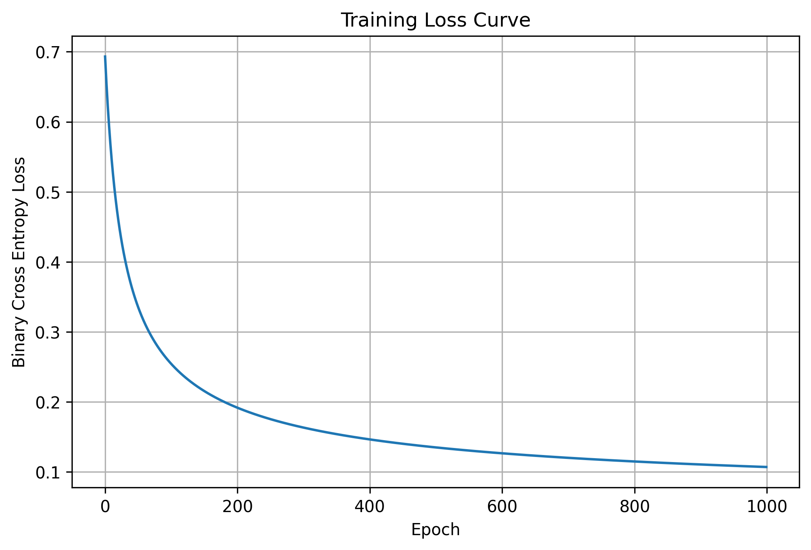

# Logistic Regression From Scratch using NumPy

A complete implementation of **Logistic Regression from scratch** using **NumPy** without using `sklearn`'s `LogisticRegression` algorithm.

This project demonstrates the mathematics behind Logistic Regression, Gradient Descent optimization, Binary Cross-Entropy Loss, and evaluation metrics while comparing the custom implementation with Scikit-learn.

---

## Features

- Logistic Regression implemented from scratch
- Vectorized Gradient Descent
- Sigmoid Function
- Binary Cross Entropy (Log Loss)
- Prediction Probabilities
- Binary Classification
- Accuracy
- Precision
- Recall
- F1 Score
- Confusion Matrix
- Comparison with Scikit-learn Logistic Regression

---

## Dataset

**Breast Cancer Wisconsin Dataset**

```python
from sklearn.datasets import load_breast_cancer
```

---

## Technologies Used

- Python
- NumPy
- Matplotlib
- Scikit-learn

---

## Project Workflow

1. Load Dataset
2. Train-Test Split
3. Feature Scaling
4. Train Logistic Regression from Scratch
5. Predict Test Data
6. Evaluate Performance
7. Compare with Scikit-learn

---

# Training Loss Curve



The loss decreases steadily over epochs, showing that Gradient Descent successfully minimizes the Binary Cross-Entropy Loss and the model converges during training.

---

## Evaluation Metrics

- Accuracy
- Precision
- Recall
- F1 Score
- Confusion Matrix

---

## Comparison

The custom implementation is compared with:

```python
sklearn.linear_model.LogisticRegression
```

to verify the correctness of the implementation.

---

## Learning Outcomes

Through this project I learned:

- Logistic Regression Mathematics
- Sigmoid Function
- Binary Cross Entropy Loss
- Gradient Descent
- Vectorized NumPy Operations
- Object-Oriented Programming (OOP)
- Model Evaluation Metrics

---

## Future Improvements

- L1/L2 Regularization
- Mini-batch Gradient Descent
- Early Stopping
- ROC Curve & AUC
- Multi-class Logistic Regression

---

## Author

**Ratnambar Baghel**

Machine Learning Enthusiast 🚀
