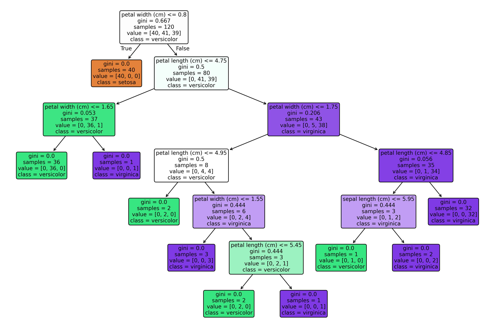
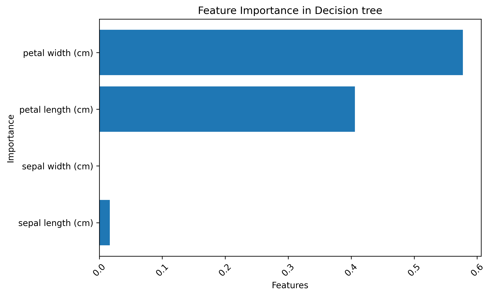
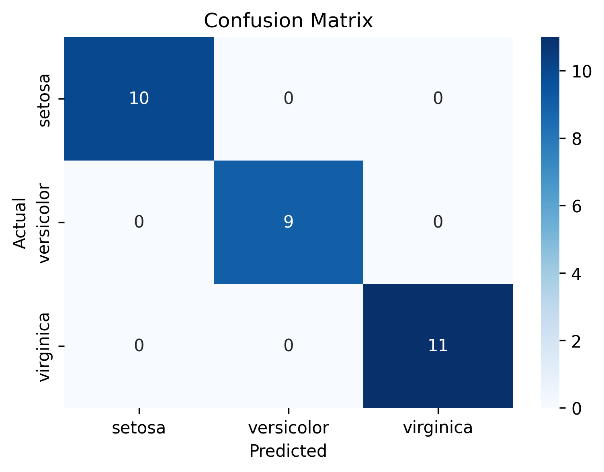
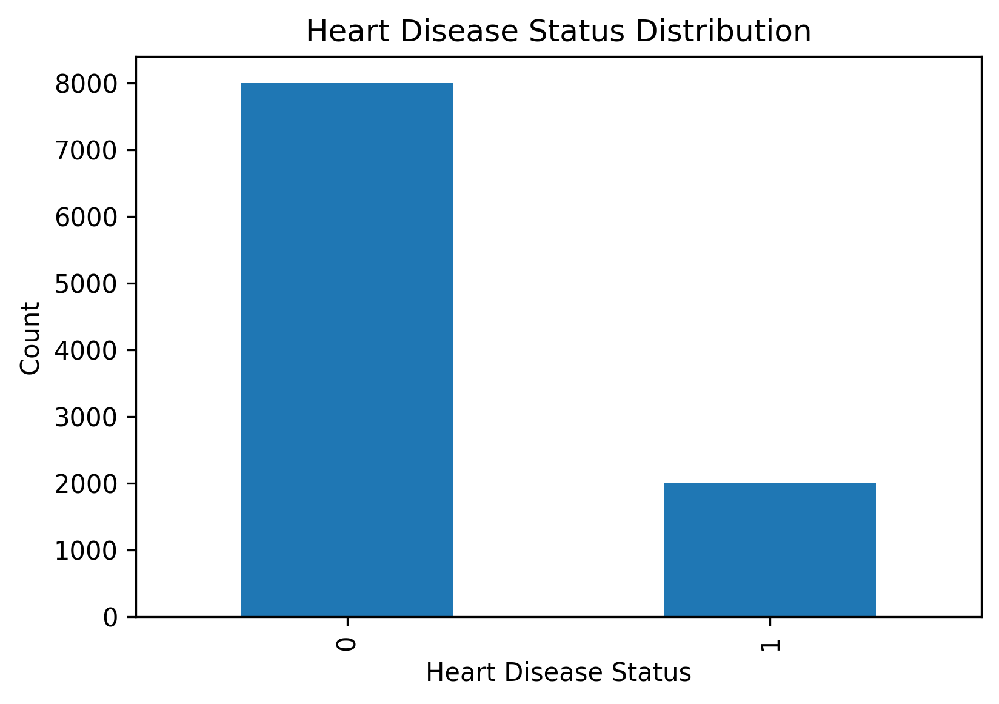
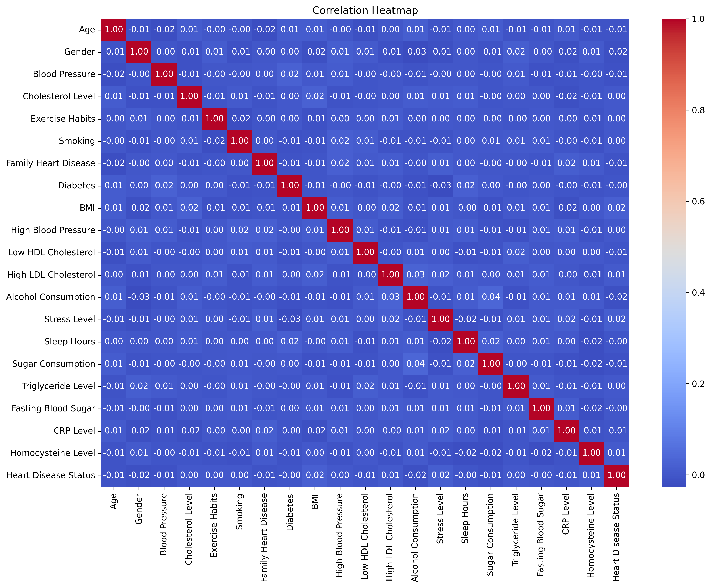

# 🌳 Decision Tree

This folder contains my complete learning journey for the **Decision Tree** algorithm, starting from Binary Trees to building a real-world Machine Learning project.

## 📂 Folder Structure

```text
03 Decision Tree/
│
├── Binary_Tree.ipynb
├── Decision_Tree_From_Scratch.ipynb
├── Decision_Tree_Mini_Project.ipynb
│
├── images/
│   ├── heart_disease_status_distribution.png
│   ├── correlation_heatmap.png
│   ├── confusion_matrix.png
│   ├── feature_importance.png
│   ├── decision_tree_visualization.png
│   └── max_depth_comparison.png
│
└── README.md
```

---

# 📖 Contents

### 1. Binary Tree

This notebook covers the fundamental concepts of Binary Trees, including:

* Binary Tree Terminology
* Types of Binary Trees
* Tree Traversals

  * Preorder
  * Inorder
  * Postorder
  * Level Order
* Binary Tree Practice Problems

---

### 2. Decision Tree From Scratch

This notebook explains the complete theory behind Decision Trees.

Topics covered:

* What is a Decision Tree?
* Entropy
* Information Gain
* Gini Index
* Splitting Criteria
* Leaf Nodes
* Internal Nodes
* Decision Tree Construction
* Advantages and Disadvantages
* Scikit-learn Implementation

---

### 3. Decision Tree Mini Project

## Heart Disease Prediction

### Objective

Build a Decision Tree Classifier to predict whether a patient has heart disease based on medical information.

---

## Machine Learning Workflow

* Import Libraries
* Load Dataset
* Data Exploration
* Missing Value Handling
* Label Encoding
* Exploratory Data Analysis (EDA)
* Train-Test Split
* Decision Tree Training
* Model Evaluation
* Hyperparameter Tuning
* Feature Importance
* Decision Tree Visualization
* Conclusion

---

## Dataset Features

The dataset contains patient health information such as:

* Age
* Gender
* Blood Pressure
* Cholesterol Level
* Exercise Habits
* Smoking
* Diabetes
* BMI
* Stress Level
* Sleep Hours
* Triglyceride Level
* Fasting Blood Sugar
* CRP Level
* Homocysteine Level

Target Variable:

* Heart Disease Status

---

## Technologies Used

* Python
* NumPy
* Pandas
* Matplotlib
* Seaborn
* Scikit-learn

---

## Model Performance

### Default Decision Tree

* Test Accuracy: **66.85%**

### Optimized Decision Tree

Hyperparameter used:

* `max_depth = 2`

Results:

* Training Accuracy: **79.84%**
* Testing Accuracy: **80.65%**

The optimized model achieved better performance by reducing overfitting through pre-pruning.

---

## Visualizations

This project includes:

* Heart Disease Distribution
* Correlation Heatmap
* Confusion Matrix
* Feature Importance
* Decision Tree Visualization
* Max Depth Comparison

---

## Decision Tree Visualization



## Feature Importance



## Confusion Matrix



---
## Decision Tree mini project Visualization



## Correlation



---

## Key Learnings

Through this project, I learned:

* Binary Tree fundamentals
* Decision Tree theory
* Entropy
* Information Gain
* Gini Index
* Data preprocessing
* Missing value handling
* Label Encoding
* Exploratory Data Analysis
* Model training
* Hyperparameter tuning
* Model evaluation
* Feature importance analysis
* Decision Tree visualization

---

## Author

**Ratnambar**

B.Tech – Artificial Intelligence & Machine Learning

This repository is part of my Machine Learning learning journey.
